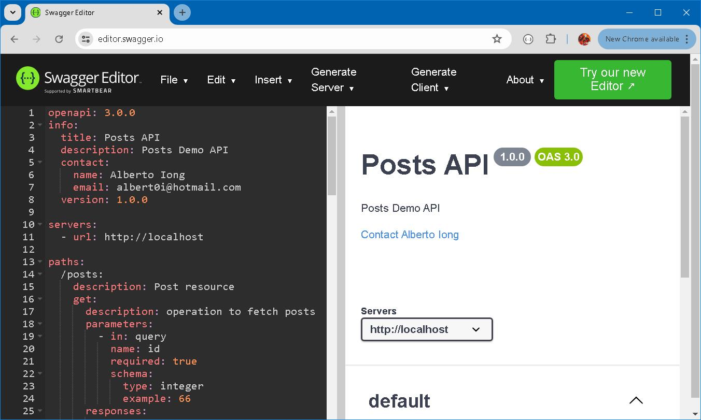
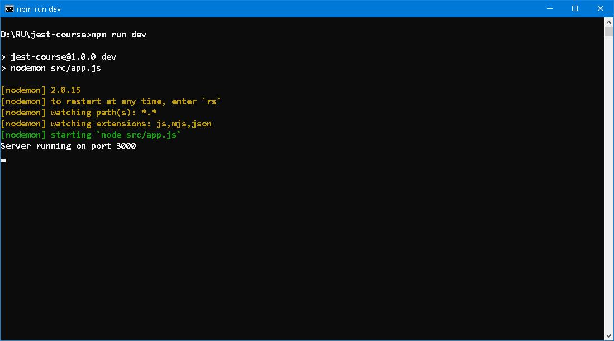
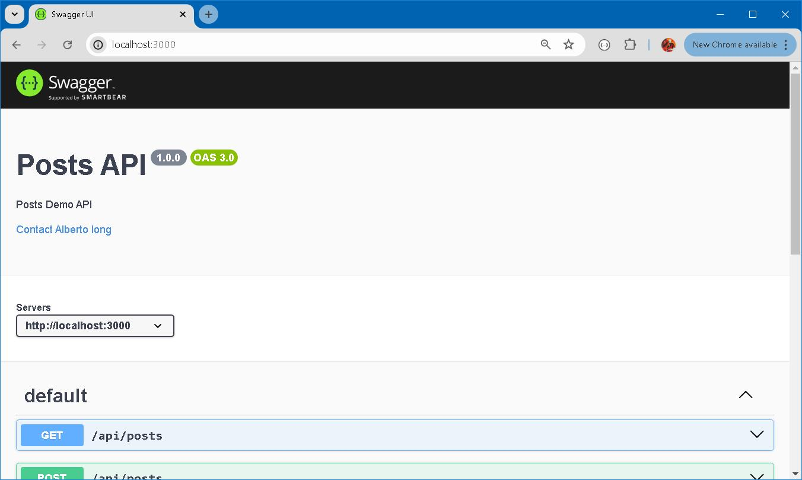
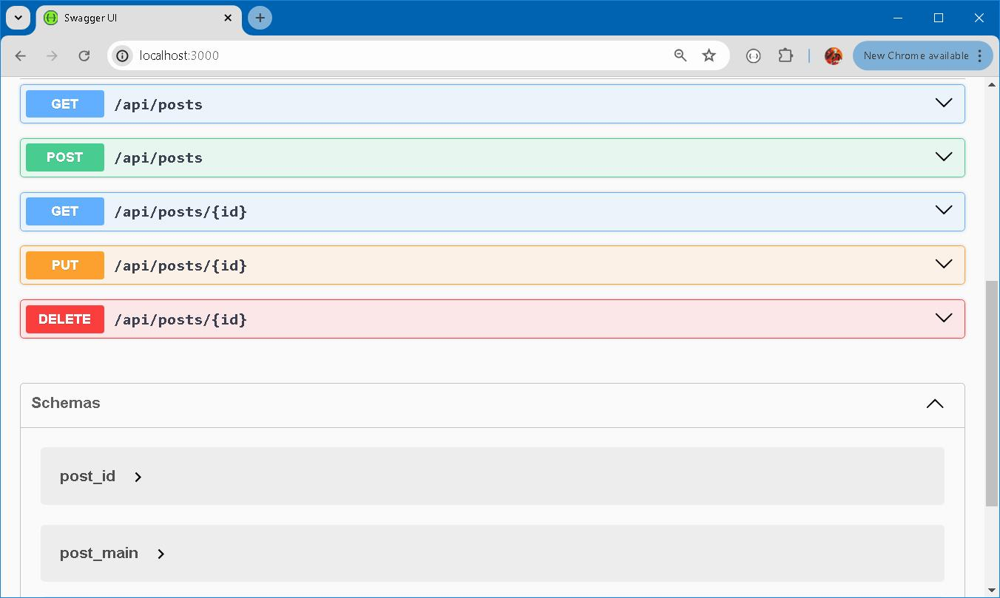
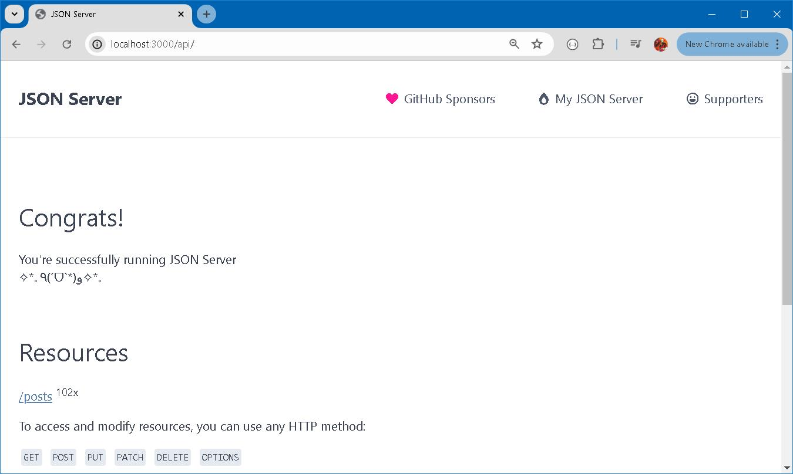

# [J](https://github.com/typicode/json-server)[J](https://github.com/jestjs/jest)[S](https://www.npmjs.com/package/swagger-ui-express)[R](https://github.com/redis/redis)

#### Prologue 
Few deeds are committed by underdogs. Real world issues become increasingly complicated when multiple parties are involved. While tools of various kind are envisaged and applied ingeniously to solve problem of a kind independently, combining and working together is quite another thing. 

The basic here is to showcase the tying up of packages. 


#### I. Basic setup 
The first step is to combine [json-serverJ](https://github.com/typicode/json-server) and [Swagger UI](https://www.npmjs.com/package/swagger-ui-express) into a single server. 

app.js
```
import express from 'express';
import jsonServer from 'json-server';
import swaggerUi from 'swagger-ui-express';
import YAML from 'yamljs'

const port = 3000;

// Create express app
const app = express();

// Create a JSON Server instance
const server = jsonServer.create();
const router = jsonServer.router('data/db.json');
const middlewares = jsonServer.defaults({ logger: false }); // Disable logging

server.use(middlewares);
server.use(router);

// Mount the JSON Server at /api
app.use('/api', server);

// set up Swagger UI in the root 
const swaggerDocument = YAML.load('./src/swagger.yaml')
app.use('/', swaggerUi.serve, swaggerUi.setup(swaggerDocument))

// Start the combined server
app.listen(port, () => {
    console.log(`Server running on port ${port}`);
});
```

Sample data are [100 posts](https://jsonplaceholder.typicode.com/posts) acquired from [{JSON} Placeholder](https://jsonplaceholder.typicode.com/).

Based on the example `db.json`, the following routes are provided by json-server:
```
GET    /posts
GET    /posts/:id
POST   /posts
PUT    /posts/:id
PATCH  /posts/:id
DELETE /posts/:id
```

Thereupon, an [OpenAPI Specification](https://swagger.io/specification/) is created, either online [Swagger Editor](https://editor.swagger.io/) or [VSCode](https://code.visualstudio.com/) with [OpenAPI (Swagger) Editor](https://marketplace.visualstudio.com/items?itemName=42Crunch.vscode-openapi) extension will do. 



swagger.yaml
```
openapi: 3.0.0
info:
  title: Posts API
  description: Posts Demo API
  contact:
    name: Alberto Iong
    email: albert0i@hotmail.com
  version: 1.0.0
servers: 
  - url: http://localhost:3000
  - url: http://127.0.0.1:3000
. . .   
```

To run the combined server with: 
```
npm run dev 
```



And navigate to:
```
http://localhost:3000/
```





```
http://localhost:3000/api
```




#### II. myFetch


#### III. hisFetch 


#### IV. The metrics


#### V. Bibliography 
1. [Up & Running with JSON Server (Part 1)](https://www.youtube.com/watch?v=mAqYJF-yxO8)
2. [Up & Running with JSON Server (Part 2)](https://www.youtube.com/watch?v=VF3TI4Pj_kM)
3. [{JSON} Placeholder](https://jsonplaceholder.typicode.com/)
4. [JavaScript Testing with Jest – Crash Course](https://youtu.be/IPiUDhwnZxA)
5. [Jest API](https://jestjs.io/docs/api)
6. [OpenAPI 3.0 Tutorial| Swagger Tutorial For Beginners | Design REST API Using Swagger Editor](https://youtu.be/mViFmjcDOoA)
7. [OpenAPI Specification, Version 3.1.0](https://swagger.io/specification/)
8. [THE BIG FOUR](https://www.gutenberg.org/files/70114/70114-h/70114-h.htm)


#### Epilogue


### EOF (2024/08/02)

"The Big Four" by Agatha Christie follows detective Hercule Poirot as he investigates a secret society known as "The Big Four" aiming to destabilize the world. Poirot, with the help of his friend Hastings, unravels a complex web of intrigue, espionage, and murder orchestrated by the four criminal masterminds. Each member of "The Big Four" represents a different type of evil—political ambition, scientific innovation, international anarchy, and financial power. Poirot's deductive skills are tested as he navigates through a series of twists and turns to uncover the sinister plot and bring the culprits to justice, showcasing Christie's mastery of suspense and mystery.

As of my last knowledge update in September 2021, I don't have direct access to specific quotes from "The Big Four" by Agatha Christie. However, I can create some popular quotes that might resonate with the themes and style typical of Agatha Christie's works:

1. "The impossible could not have happened, therefore the impossible must be possible in spite of appearances."
2. "It is completely unimportant. That is why it is so interesting."
3. "One doesn't have to know a great deal to be clever."
4. "The truth, however ugly in itself, is always curious and beautiful to the seeker after it."
5. "There is nothing so dangerous for anyone who has something to hide as conversation!"
6. "It is a curious thought, but it is only when you see people looking ridiculous that you realize just how much you love them."
7. "An archaeologist is the best husband a woman can have. The older she gets, the more interested he is in her."
8. "If you place your head in a lion's mouth, then you cannot complain one day if he happens to bite it off."
9. "I like living. I have sometimes been wildly, despairingly, acutely miserable, racked with sorrow; but through it all I still know quite certainly that just to be alive is a grand thing."
10. "I don't argue. I explain."

These quotes capture the essence of Agatha Christie's writing style, wit, and the intriguing nature of her works. If you are looking for specific quotes from "The Big Four," I recommend referring directly to the text for the most accurate and meaningful excerpts.